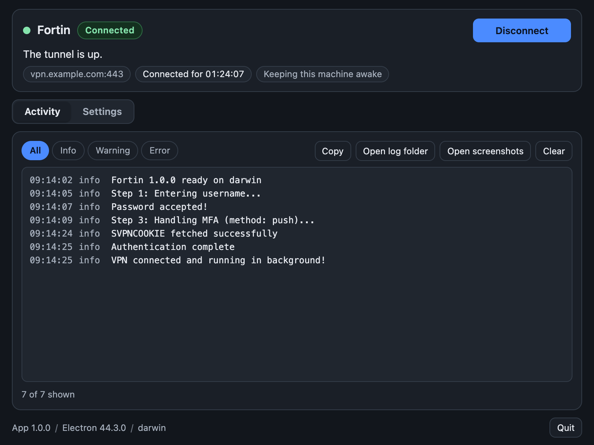
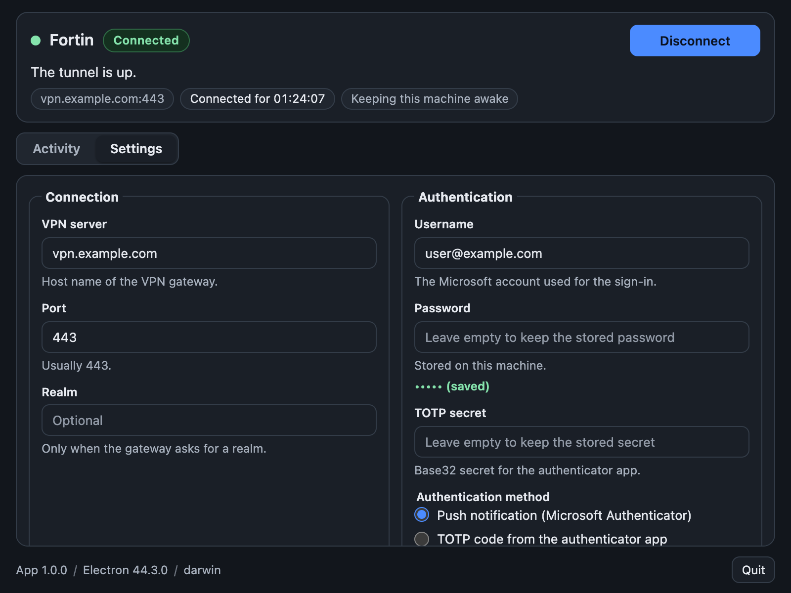
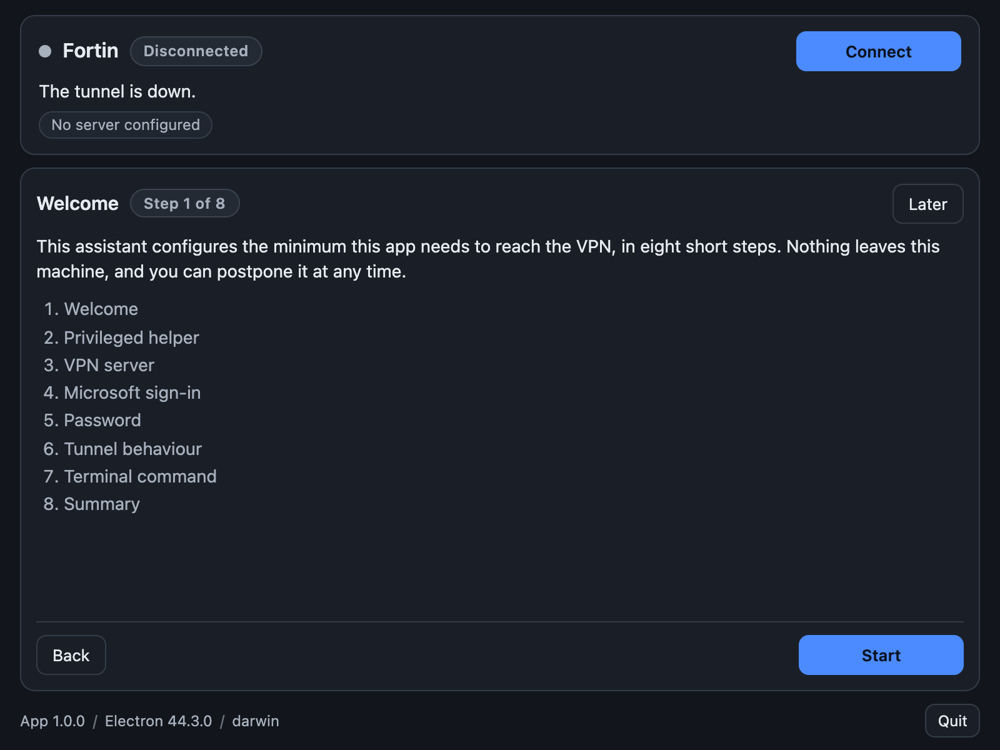

#  Fortin

Fortin is a menu bar application and a command line tool that connects to a FortiClient SSL VPN
gateway. It completes the Microsoft sign-in (SAML with Entra ID) in a real Chrome window, keeps the
resulting session cookie and hands it to `openfortivpn`, which opens the tunnel. Push notification
and TOTP both work as the second factor.

Fortin is not affiliated with, endorsed by or supported by Fortinet.

## Screenshots

The window with the tunnel up, and the activity log it writes:



Settings holds every field of the configuration:



The first start walks through the setup assistant:



## Install

Homebrew is the shortest path:

```bash
brew install --cask juanavilactn/tap/fortin
fortin status
```

The cask installs `Fortin.app` in `/Applications` and links the `fortin` command into the `bin`
directory of Homebrew, which a new terminal already searches.

Homebrew 7 refuses to load the cask of a third-party tap by its bare name until the tap is trusted.
A session that taps first and then runs `brew install --cask fortin` needs one more command:

```bash
brew tap juanavilactn/tap
brew trust juanavilactn/tap
brew install --cask fortin
```

The application is signed ad-hoc and it is not notarized, so macOS puts the download in quarantine
and the first start ends with a message about an unidentified developer. Approve it once in System
Settings, Privacy and Security, "Open Anyway", or drop the flag from a terminal:

```bash
xattr -dr com.apple.quarantine "/Applications/Fortin.app"
```

The command runs the binary of the same bundle, so that one flag covers both.

Without Homebrew, download the disk image from the
[releases page](https://github.com/juanavilactn/fortin/releases), drag the application into
`Applications` and link the command once:

```bash
"/Applications/Fortin.app/Contents/Resources/cli/fortin" cli install
```

The releases page carries the macOS disk images. Linux and Windows have build targets in the repository, but no published build yet.

## Requirements

- Google Chrome or Chromium. The application drives a real browser, so the Microsoft sign-in looks
  like a normal session. Set `chromePath` in the settings, or `CHROME_PATH` in the environment, when
  Chrome lives somewhere unusual.
- `openfortivpn`. The macOS helper installer brings its own copy. On Debian and Ubuntu, install it
  with `sudo apt install openfortivpn`. On Windows, you need `openfortivpn.exe` plus the TAP-Windows
  adapter.
- One administrator confirmation, the first time, to install the privileged helper.

## First run

A machine that has just installed the application has no configuration and no helper, so the first
start opens a setup assistant instead of a window that can only say it is not connected. Eight steps:
welcome, privileged helper, gateway, Microsoft account and method, password and secrets, tunnel
behaviour, the terminal command, and a summary with `Connect now`.

`Later` postpones the assistant. It does not open again at the next start: the window keeps a banner
that says what is missing and opens it again from there. To repeat it by hand, use `Run setup` in the
menu bar menu, or `fortin setup reset` in a terminal.

## Using the application

The menu bar icon is the main control. A left click connects when the tunnel is down and disconnects
when it is up. The right-click menu offers the same action, the window, the settings and the log
folder. Closing the window leaves the application running in the menu bar; `Quit` stops it and takes
the tunnel down with it, so a root-owned tunnel never outlives the window.

The window shows the state, the server, how long the tunnel has been up in a live counter, and what
the application is doing right now: the sign-in step, the push code to approve, the reconnect attempt
in progress. It also has:

- `Connect` and `Disconnect`, and a `Cancel` while an attempt is running.
- An `Activity` panel with the log, a level filter, `Copy` and `Clear`, and the last 500 lines.
- A `Settings` panel with every field of the configuration, validated before saving. A stored
  password or TOTP secret shows empty: leave it empty to keep the stored value.
- `Install VPN helper`, which appears when the helper is missing or was not authorized.
- `Open log folder` and `Open screenshots`, for `~/.fortin/logs/` and `~/.fortin/screenshots/`.

The system notifies you when the tunnel connects, disconnects or comes back after a drop. When no
password is stored, the application asks for it in a window, and again after a rejected attempt,
three times before it gives up.

## Command line

The installed application carries the same tool. It runs the same session as the window, with one
configuration file, one secret store, one log and one login item, and it needs no display.

| Command | What it does |
| --- | --- |
| `start` | Connect. It runs in the background and returns with the tunnel up; `-f` follows the tunnel in the terminal. Flags: `--push`, `--totp`, `--headless`, `--no-headless`, `--debug-screenshots`, `-s/--server`, `-p/--port`, `-u/--username`, `-P/--password`, `-t/--totp-secret`, `-r/--realm` |
| `stop` | Disconnect the tunnel, whoever started it. A stop that you asked for is never undone |
| `status` | State, background PID and the log file in use |
| `watch` | Follow the state and the progress lines until Ctrl-C, without touching the tunnel |
| `config get` | Configuration, secret store, environment overrides, paths and the answer of the initial setup |
| `config set <key> <value>` | Change one or more values. Booleans take true/false/1/0/yes/no/on/off |
| `secrets status` | Which secrets exist and where they live, never their values |
| `secrets set <name>` | Store `password`, `totpSecret` or `svpnCookie`, read from the terminal |
| `secrets delete <name>` | Remove a secret from the store and from the configuration file |
| `login-item status` | What the system holds for start at login |
| `login-item enable` | Register the login item, pointing at the installed application |
| `login-item disable` | Remove the login item |
| `logs [-n N]` | Last lines of the current log file, 200 by default |
| `helper status` | Privileged helper and `openfortivpn`, with the exit code |
| `helper install` | Install the privileged helper once, with one admin confirmation (`setup` is an alias) |
| `setup status` | Where the initial setup stands, and what is missing |
| `setup complete`, `setup skip`, `setup reset` | Answer the assistant by hand, or make it appear again |
| `cli status` | The launcher of this build and the state of the link in the `PATH` |
| `cli install [--dir DIR]` | Link the tool into a directory of the `PATH`. `--force` replaces what is there |
| `cli uninstall` | Remove that link |
| `info` | Version, platform, provider, paths and secret store |
| `version` | The version only |
| `doctor` | Configuration, secrets, login item, helper, client, tunnel, setup and log in one read-only report |
| `help` | The help text |

`--json` writes one object on stdout and nothing else, with the answer in `result` and the exit code
at 0 or 1, and moves the log lines to stderr, so a script can read the answer alone:

```bash
fortin status --json | jq -r '.result.state'
```

Secrets never come from the command line. `secrets set` reads the value from the terminal, hidden
when there is one, and as the first line of the input when it is a pipe:

```bash
fortin secrets set password
printf %s "$VPN_PASSWORD" | fortin secrets set password
```

No command prints a secret. `-P/--password` on `start` still wins over the stored one for that run.
`svpnCookie` needs a system store: without one, `secrets set svpnCookie` refuses instead of writing
the cookie to the configuration file.

## Settings

`~/.fortin/config.json`, mode 0600:

| Field | Description | Required |
| --- | --- | --- |
| `vpnServer` | VPN host, without `https://` and without a path | yes |
| `vpnPort` | Port, default `443` | no |
| `vpnRealm` | VPN realm or group, when the FortiGate requires one | no |
| `username` | Microsoft account (email) | yes |
| `password` | Password. Kept in the system store, not in this file | yes, or the application asks for it |
| `totpSecret` | Base32 TOTP secret, only for `authMethod: "totp"` | yes for TOTP |
| `authMethod` | `push` (approve on the phone) or `totp` (code generated locally) | no, default `push` |
| `headless` | `true` hides the browser window, `false` shows it for debugging | no, default `true` |
| `trustedCert` | Certificate fingerprint, or `any` | no, default `any` |
| `chromePath` | Explicit Chrome or Chromium executable | no |
| `keepAwake` | `true` holds the machine awake while the tunnel is up | no, default `true` |
| `autoReconnect` | `true` reconnects after a tunnel that drops unasked | no, default `true` |
| `startAtLogin` | `true` starts the application when you log in, in the menu bar | no, default `false` |

The assistant also writes `setupCompleted`, `setupSkipped`, `setupVersion` and `setupDecidedAt`, and
`config set` leaves those four alone.

`password` and `totpSecret` are items of the system secret store, never fields of this file. On a
machine without a store (Linux without `secret-tool`, or Windows) they stay in the file with mode
0600, and the window says that they are not protected by the system.

Environment variables override the file: `VPN_SERVER`, `VPN_PORT`, `VPN_REALM`, `VPN_USERNAME`,
`VPN_PASSWORD`, `VPN_TOTP_SECRET`, `VPN_AUTH_METHOD`, `VPN_HEADLESS`, `VPN_TRUSTED_CERT`,
`CHROME_PATH`, `VPN_DEBUG_SCREENSHOTS`, `VPN_KEEP_AWAKE`, `VPN_AUTO_RECONNECT`,
`VPN_START_AT_LOGIN`. `FORTIN_CONFIG` points the application at a different `config.json`, and
`FORTIN_SECRET_STORE=file` keeps the secrets in that file and leaves the system store alone.

## Keeping the tunnel up

The tunnel stays up until you disconnect it. An idle machine does not end the session, and a tunnel
that dies on its own is reopened without you: the application tries the last cookie first and falls
back to a full Microsoft sign-in, waiting 5, 10, 20, 30, 60 and 60 seconds between attempts. After
six consecutive failures it stops with an error instead of retrying forever. A resume from suspend or
an unlock checks the tunnel at once. A disconnect that you asked for is never overridden: `stop` in
the terminal ends a tunnel the window opened, and `Disconnect` in the window ends one a terminal
started.

While the tunnel is up, the application holds the machine awake, so an idle laptop or a closed lid
does not lose the VPN. It releases the hold when the tunnel goes down.

Both behaviours are settings, `keepAwake` and `autoReconnect`, and both are on by default. The
tradeoff is battery: a machine that is not allowed to sleep drains faster while it is unplugged. Turn
`keepAwake` off when you work on battery and do not need the tunnel.

## Start at login

Turn on `Start Fortin when I log in` in `Settings` and the application starts with your session, in
the menu bar and without a window.

| Platform | Entry | Where you see it |
| --- | --- | --- |
| macOS | a LaunchAgent in `~/Library/LaunchAgents/`, with `RunAtLoad` and `KeepAlive` false | System Settings, General, Login Items, under "Allow in the background". macOS may report that a background item was added |
| Linux | `~/.config/autostart/fortin.desktop` | The startup applications of the desktop environment |
| Windows | The `Run` value `Fortin` of the user (`HKCU`) | Task Manager, Startup |

Saving reports what the system did, and a refusal is written to the log without discarding the rest
of your configuration. The switch needs an installed application, so it stays disabled in a
development run.

## Security

- The password and the TOTP secret are items of the service `fortin` in the system store, one
  account per field. The command line reads the same items.
- The configuration file holds the rest, with mode 0600 in a 0700 directory. It keeps the secrets
  only when the machine has no store.
- Check an item without printing its value:
  `security find-generic-password -s fortin -a password` on macOS. Remove it with
  `security delete-generic-password -s fortin -a password`.
- The TOTP secret makes unattended login possible. Prefer `authMethod: "push"` unless you need the
  fully automated flow.
- Cookies are masked in the log. The last successful cookie is kept in the same store under
  `svpnCookie` and is removed when you disconnect.
- A failed tunnel start is written to `~/.fortin/logs/tunnel.log`, where `openfortivpn` explains the
  real cause. The last lines of that file are copied into the application log.

## Troubleshooting

**Chrome not found.** Install Google Chrome, or set `chromePath` to the executable
(`/Applications/Google Chrome.app/Contents/MacOS/Google Chrome`, `/usr/bin/google-chrome`,
`C:\Program Files\Google\Chrome\Application\chrome.exe`).

**Helper not installed.** Click `Install VPN helper` in the window, or run `fortin setup`. On macOS
and Linux this is a one-time admin confirmation, and later connects do not ask again.

**`openfortivpn` missing.** Linux: `sudo apt install openfortivpn`. Windows: install
`openfortivpn.exe` and the TAP-Windows driver.

**"Gateway certificate validation failed".** `openfortivpn` wants the sha256 digest of the gateway
certificate. The application log prints the value in the line `--trusted-cert <digest>`; paste that
fingerprint into `Trusted certificate` in the settings and connect again.

**Password rejected.** Three attempts are allowed, then the run stops. Debug with `headless: false`
and the debug screenshots switch, and inspect the PNG and HTML files in `~/.fortin/screenshots/`.

**Push notification timeout.** The application waits two minutes for the approval. Check that the
phone has connectivity, and try `authMethod: "totp"` as an alternative.

**Windows raises a UAC prompt on every connect and disconnect.** Expected: Windows has no `sudoers`
equivalent, so the tunnel is started elevated each time.

## Known limits

- macOS is the platform exercised against a real gateway. The Linux and Windows paths ship as code
  and build targets, and they were reviewed, not executed, because the test machine is macOS. That
  includes the Windows keep-awake helper and the Linux autostart entry.
- Windows needs `openfortivpn.exe` plus a TAP-Windows adapter, and every connect and disconnect
  raises one UAC confirmation.
- Keeping the machine awake costs battery while the tunnel is up, especially on a laptop running
  unplugged.
- The sign-in drives the real Microsoft page, so a change on that side can break the flow until the
  automation follows it.

## From source

```bash
npm install
node node_modules/electron/install.js   # the npm lifecycle scripts are disabled here on purpose
npm start
```

Node.js 22.15 or newer. The command line works from a checkout without Electron
(`node src/cli.js help`), and `npm test` runs the suite.

## License

MIT.
